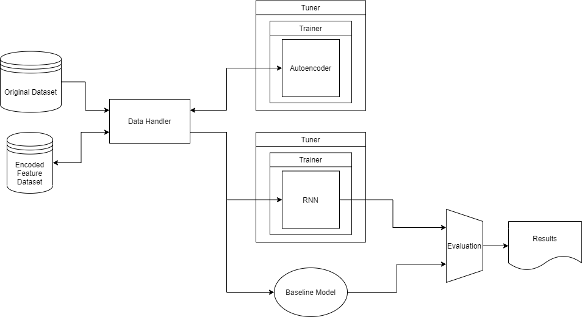

[](https://www.python.org/downloads/)
[](https://github.com/psf/black)
[](https://pre-commit.com/)
[](https://github.com/DM1122/spotify-skip-prediction)
[](https://github.com/DM1122/spotify-skip-prediction)

# Spotify Skip Prediction
<p align="left"></p>
APS360 project repository

TODO: Add project description

# Systems
<p align="center"></p>

# Project Management
See the repo's [project page](https://github.com/DM1122/spotify-skip-prediction/projects/1) for ongoing tasks.

# Contribution
## Setup
This section will take you through the procedure to configure your development environment. Ensure you have installed the project's python version.

The repo employs [poetry](https://python-poetry.org/) as its dependency and environment manager. Poetry can be installed through the Windows Powershell via:
```
(Invoke-WebRequest -Uri https://raw.githubusercontent.com/python-poetry/poetry/master/get-poetry.py -UseBasicParsing).Content | python -
```

Clone the repo using github desktop or the commandline via:

```
git clone https://github.com/DM1122/spotify-skip-prediction.git
```

From within the cloned repo, run poetry's install command to install all the dependencies in one go:
```
poetry install
```

To make VSCode use the virtual environment that poetry created, add poetry's virtual environment path `C:\Users\<USERNAME>\AppData\Local\pypoetry\Cache\virtualenvs` to VSCode's `Venv Path` under `File>Preferences>Settings`. Once you have done so, enter the command pallet by going to `View>Command Palette` and search for `Python:Select Interpreter`. Select poetry's virtual environment for the repo.

Install the pre-commit script and hooks using:
```
pre-commit install --install-hooks
```

You're now ready to start contributing!

## Adding Packages
To add a new package to the poetry virtual environment, install it via:
```
poetry add <PACKAGE>
```
This is poetry's version of `pip install <PACKAGE>`.


## Testing
This repo uses [pytest](https://docs.pytest.org/en/6.2.x/) for unit testing. To run all unit tests, call:

```
pytest -v
```

You can find an interactive report of test results in `./logs/pytest-report.html`. Indivdual tests can also be specified as follows:
```
pytest tests/test_main.py::my_test_function
```

Groups of tests can be run using markers. Assign a marker decorator to the group of functions you want to test like this:

```
@pytest.mark.foo
def my_test_function():
    # some test
```

To use the custom marker `foo`, it must be added to the list of custom pytest markers in `pyproject.toml>[tool.pytest.ini_options]>markers`. The tests marked with `foo` can then be run by calling:
```
pytest -m foo
```


## Commits
### Pre-Commit
This repo is configured to use [pre-commit](https://pre-commit.com/) hooks. The pre-commit pipeline is as follows:

1. [Isort](https://pycqa.github.io/isort/): Sorts imports, so you don't have to.
1. [Black](https://black.readthedocs.io/en/stable/): The uncompromising code autoformatter.
1. [Pylint](https://github.com/pycqa/pylint): It's not just a linter that annoys you!

Pre-commit will run the hooks on commit, but when a hook fails, they can be run manually to debug using:

```
isort . & black . & pylint_runner
```

### The 5 Rules of A Great Git Commit Message
<p align="center"></p>

1. Write in the imperative.
1. Capitalize first letter in the subject line.
1. Describe what was done and why, but not how.
1. Limit subject line to 50 characters.
1. End without a period.


